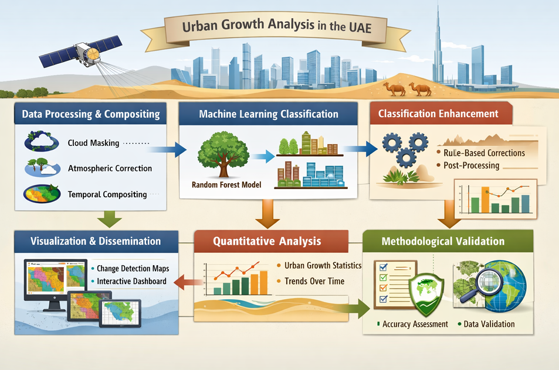
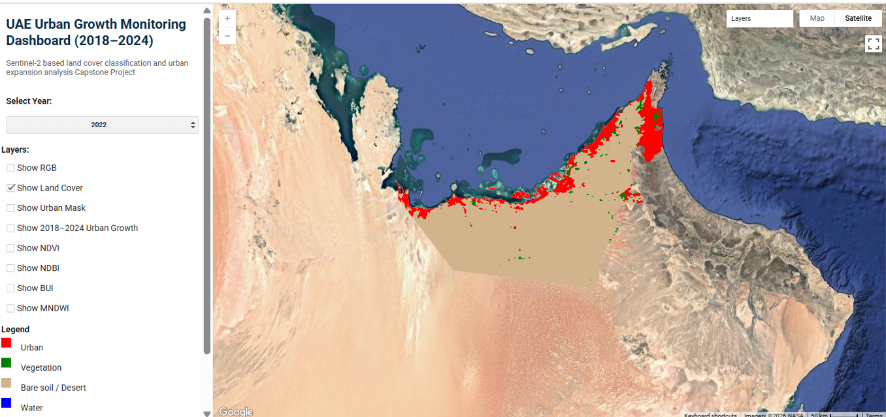

# 🇦🇪 UAE Urban Growth Analysis — 2018–2024

## 📌 Project Overview

This capstone project develops an end-to-end **remote sensing and GIS workflow** to monitor and quantify urban growth across the **United Arab Emirates (UAE)** from **2018 to 2024**.

The study combines **Sentinel-2 imagery, Google Earth Engine, spectral indices, and Random Forest classification** to produce land-cover maps and urban growth statistics.

## 🎯 Objectives

- Generate cloud-free Sentinel-2 composites for 2018–2024.
- Classify **Urban, Vegetation, Bare Soil, and Water**.
- Apply spectral indices adapted to arid environments.
- Quantify urban expansion and land-cover changes.
- Assess classification accuracy.
- Develop an interactive dashboard for visualization.

## 🌍 Study Area

**United Arab Emirates — national scale**

Main urban centers include **Abu Dhabi, Dubai, Sharjah, and Al Ain**.

## 🔄 Workflow



```text
Sentinel-2 Data
      ↓
Preprocessing & Cloud Masking
      ↓
Spectral Indices
      ↓
Training Polygons
      ↓
Random Forest Classification
      ↓
Accuracy Assessment
      ↓
Post-Classification Analysis
      ↓
Urban Growth Analysis
      ↓
Interactive Dashboard
```

## 🛰️ Data & Features

**Sentinel-2 Surface Reflectance (Level-2A)**  
Spatial resolution: **10–20 m**  
Period: **2018–2024**

Main spectral indices:

- **NDVI** — vegetation
- **NDBI** — built-up areas
- **MNDWI** — water
- **BUI** — built-up index
- **DUI** — desert/urban discrimination

Training data were generated using **manual reference polygons**.


## 🤖 Classification

A **Random Forest classifier** was trained using spectral bands and derived indices.

Classes:

| Class | Description |
|---|---|
| 🏙️ Urban | Built-up areas |
| 🌿 Vegetation | Vegetated areas |
| 🏜️ Bare Soil | Desert and exposed soil |
| 💧 Water | Water bodies |


## 📊 Key Results

- **Overall Accuracy (2018): 90.8%**
- **Kappa Coefficient: 0.859**
- **Urban Growth (2018–2024): +4,394.96 km²**
- **Percentage Growth: +61.1%**
- **Average Annual Growth Rate: ~10.18%**

## 📈 Interactive Dashboard

An interactive dashboard was developed to visualize:

- Land-cover classification
- Spectral indices
- Urban expansion
- Spatial statistics
- Temporal changes



## 🛠️ Technologies

**Google Earth Engine · Sentinel-2 · JavaScript · Random Forest · GIS · Remote Sensing**
```

## 👩‍💻 Authors

**Sahar Feki · Yessmine Chaabouni**

Geomatics Engineering Students

## 📜 License

This project is intended for **academic and research purposes**.
